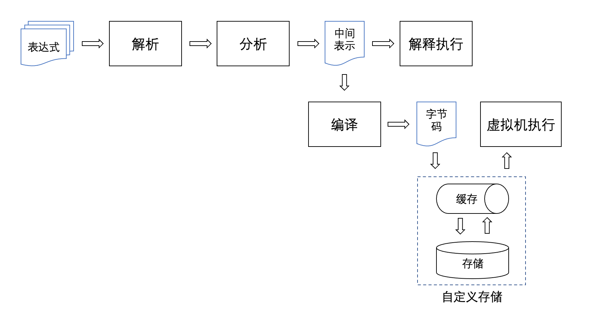

# rspression
## 总体介绍
rspression是一款用rust编写的高性能、轻量级表达式计算引擎，旨在提高用户系统在不同业务场景下的扩展能力。

### 设计背景
传统的表达式引擎对表达式的执行过程一般是将表达式解析为语法树，然后直接解释执行语法树，这种方式适合公式表达式数量比较少的情况，每次从头解析、分析、执行，性能上也不会有太大问题。但如果每次需要执行的表达式数量都有成千上万条，那么每执行一次都从0开始做解析，就会造成资源的浪费。如果系统是单机环境，倒是可以把中间表示结构缓存在内存中。但如果系统是集群部署，缓存是类似redis的独立服务，则中间结构所占的空间就太大了，读写缓存时序列化、反序列化、网络传输会占用很多时间。

针对这种背景，rspression提供了两种执行表达式的方式，一是传统的直接执行表达式字符串，适合表达式数量较少的情况。二是字节码运行模式，业务系统在配置好表达式以后，可以先将表达式编译为字节码(Chunk)，然后将字节码放入缓存或者数据库、文件等存储服务中。最后需要执行的时候，从存储/缓存服务中读取出字节码再由虚拟机运行。



字节码运行模式与中间表示对象(IR)序列化/反序列化再运行有本质区别，通常对IR对象做存储或者网络传输前需要先经过序列化的过程，然后经过网络传输或者从存储中读取到序列化结果后，想要运行则又必须先经过反序列化为对象的过程。不同于序列化反序列化，字节码本身就是一个字节数组，字符串格式的表达式被编译成字节码后，无须经过序列化就可以直接进行网络传输，或者写入到存储服务中。而通过网络传输或者存储服务读取到的字节码，其在内存中的形式为一个字节数组，这个字节数组同样不需要反序列化就可以直接被虚拟机识别并运行。

将表达式编译为字节码虽有微小的前期性能损耗，但完美契合了表达式‘单次写入、海量复用’的业务形态。对于高并发、多表达式的业务，在创建或变更时触发单次编译，后续运行完全脱离原始结构、纯靠字节码驱动，这为数据层缓存、网络带宽以及计算节点执行带来了质的性能飞跃。

### 性能基准
为了验证字节码虚拟机的优势，我在 release 模式下对 5,000 条表达式进行了测试。电脑配置为：
- CPU: 2.2 GHz 四核Intel Core i7
- 内存: 16 GB

|  **测试指标**   | **数据结果**  |
|  ----  | ----  |
| 表达式总数量  |  5,000  |
| 所有字符串总大小  |  195KB  |
| 解释执行所有字符串用时  |  **66ms**  |
| 字符串编译为字节码用时  |  88ms  |
| 编译后的字节码大小  |  298KB  |
| 虚拟机运行字节码用时  |  **5ms**  |

可以看到，占用195KB的5000条字符串表达式，从头解析语法树再递归执行的用时有66ms，虽然把这些表达式文本编译为字节码需要更多的88ms，但以后直接通过虚拟机运行这个字节码只需要5ms。而且字节码体积仅比原始文本多了 1/2，在分布式网络传输（如 Redis 缓存同步）中具备无可比拟的带宽优势。但是，如果你选择对所有表达式对应的语法树结构体直接进行序列化，那么这个结果必然会膨胀数倍甚至十倍。

测试的代码在[这里](tests/runner_batch_tests.rs)，请在项目根目录下通过release模式运行测试，比如：
``` Shell
# 测试传统的直接执行 / 语法树求值
cargo test --release --test runner_batch_tests -- test_ir --nocapture 

# 测试字节码编译与虚拟机运行
cargo test --release --test runner_batch_tests -- test_compile_chunk --nocapture
```

## 用法说明
### 表达式求值
支持+、-、*、/、**【指数运算】、<、>、<=、>=、==、!=、%、&&、||、!、等操作符。支持Excel风格的if(cond, thenBranch, elseBranch)条件函数。
```rust
use rspression::{DefaultEnvironment, Environment, RspRunner, Value};

fn main() -> Result<(), Box<dyn std::error::Error>> {
    // Basic arithmetic
    let mut runner = RspRunner::new();
    // Simple expression
    println!("1 + 2 * 3 = {}", runner.execute("1 + 2 * 3")?); // 1 + 2 * 3 = 7

    // With variables
    let mut env = DefaultEnvironment::new();
    env.put("a".into(), Value::Integer(1));
    env.put("b".into(), Value::Integer(2));
    env.put("c".into(), Value::Integer(3));
    println!(
        "a + b * c = {}",
        runner.execute_with_env("a + b * c", &mut env)?
    ); // a + b * c = 7
    println!("{}", runner.execute_with_env("a + b * c >= 6", &mut env)?); // true

    Ok(())
}
```

### 赋值运算
支持表达式变量赋值运算，多个表达式批量进行运算时，支持根据表达式的依赖关系先进行排序，再运算。并且会对运算表达式之间是否有循环依赖进行检测。
```rust
use rspression::{DefaultEnvironment, Environment, RspRunner, Value};

fn main() -> Result<(), Box<dyn std::error::Error>> {
    let mut srcs = Vec::new();
    srcs.push("x = a + b * c");
    srcs.push("b = a * 2");
    srcs.push("a = m + n");
    srcs.push("c = n + w + b");

    let mut runner = RspRunner::new();
    let mut env = DefaultEnvironment::new();
    env.put("m".into(), Value::Integer(2));
    env.put("n".into(), Value::Integer(4));
    env.put("w".into(), Value::Integer(6));

    runner.execute_multiple_with_env(&srcs, &mut env)?;
    println!("x = {}", env.get("x").unwrap()); // x = 270
    println!("a = {}", env.get("a").unwrap()); // a = 6
    println!("b = {}", env.get("b").unwrap()); // b = 12
    println!("c = {}", env.get("c").unwrap()); // c = 22

    Ok(())
}
```

###  定义环境
表达式求值时，对于遇到的变量，求值器会从环境对象Environment中取值，赋值表达式则会把求值的结果写回到Environment中，因此对于表达式中用到的变量，具体含义需要在Environment中进行定义：
```rust
use rspression::{DefaultEnvironment, Environment, RspRunner, Value};

fn main() -> Result<(), Box<dyn std::error::Error>> {
    let mut env = DefaultEnvironment::new();
    env.put("a".into(), Value::Integer(1));
    env.put("b".into(), Value::Integer(2));
    env.put("c".into(), Value::Integer(3));
    let mut runner = RspRunner::new();
    let r = runner.execute_with_env("a + b * c", &mut env)?;
    println!("{}", r); // 7

    Ok(())
}
```
系统提供的默认环境对象为DefaultEnvironment，在执行表达式前，对于表达式中需要读取值的变量，都需要在DefaultEnvironment对象中有值。有时候需要执行的表达式数量较多，在对表达式做解析之前，业务层无法高效的把所有变量值都提前准备好，或者表达式中的变量和实际数据之间是间接的关联，这时候便可以根据需要自定义环境对象，只需实现Environment trait即可。

### 字节码运行
先把表达式编译为字节码(Chunk)，由业务系统缓存或者存储字节码，后续需要执行时直接运行字节码。
- 编译表达式：
```rust
use rspression::{ChunkView, DefaultEnvironment, Environment, RspRunner, Value};

fn main() -> Result<(), Box<dyn std::error::Error>> {
    // Compile expressions to bytecode
    // 1. get expressions
    let mut srcs = Vec::new();
    srcs.push("x = a + b * c");
    srcs.push("b = a * 2");
    srcs.push("a = m + n");
    srcs.push("c = n + w + b");
    // 2. compile expressions
    let mut runner = RspRunner::new();
    let chunk = runner.compile_source(&srcs)?;
    let bytes: Vec<u8> = chunk.to_bytes();
    // 3. you can write bytes to store or cache
    // write_to_your_storage(bytes);

    // Run bytecode
    // 1. read bytes from store or cache
    // let bytes: Vec<u8> = read_from_your_storage();
    // 2. construct chunk
    let chunk = ChunkView::from_bytes(&bytes)?;
    // 3. define environment
    let mut env = DefaultEnvironment::new();
    env.put("m".into(), Value::Integer(2));
    env.put("n".into(), Value::Integer(4));
    env.put("w".into(), Value::Integer(6));
    // 4. run bytecode
    let mut runner = RspRunner::new();
    runner.run_chunk(&chunk, &mut env)?;

    // 5. check results
    println!("x = {}", env.get("x").unwrap()); // x = 270
    println!("a = {}", env.get("a").unwrap()); // a = 6
    println!("b = {}", env.get("b").unwrap()); // b = 12
    println!("c = {}", env.get("c").unwrap()); // c = 22

    Ok(())
}
```
Chunk对象只由字节数组构成，序列化、反序列化性能极高，适合集群环境使用redis等缓存服务做缓存的场景。

## License

MIT