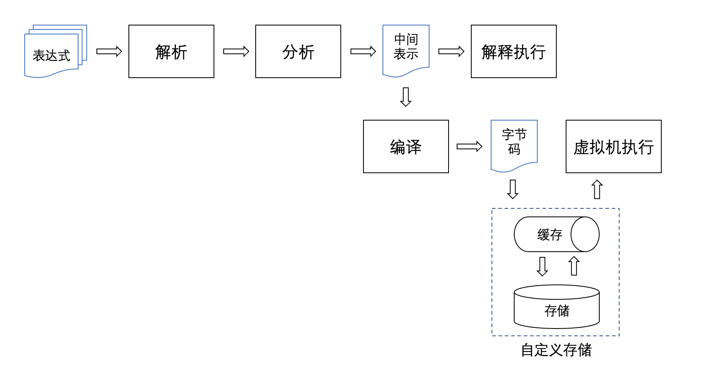
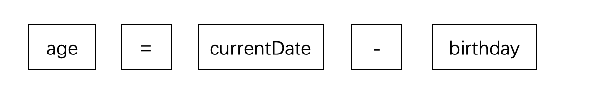

# rspression
# I. Background Introduction
rspression is a high-performance, lightweight expression calculation engine written in Rust, designed to enhance the extensibility of user systems in different business scenarios.

# II. Usage Guide
## Evaluation Mode
Supports operators such as +, -, *, /, ** (exponentiation), <, >, <=, >=, ==, !=, %, &&, ||, !, etc. Supports Excel-style if(cond, thenBranch, elseBranch) conditional functions.
```rust
use rspression::{DefaultEnvironment, Environment, RspRunner, Value};

let mut runner = RspRunner::new();
// Simple expression
println!("1 + 2 * 3 = {}", runner.execute("1 + 2 * 3")?); // 1 + 2 * 3 = 7

// With variables
let mut env = DefaultEnvironment::new();
env.put("a".to_string(), Value::Integer(1));
env.put("b".to_string(), Value::Integer(2));
env.put("c".to_string(), Value::Integer(3));
println!(
    "a + b * c = {}",
    runner.execute_with_env("a + b * c", &mut env)?
); // a + b * c = 7
println!("{}", runner.execute_with_env("a + b * c >= 6", &mut env)?); // true
```

## Computation Mode
Supports variable assignment operations in expressions. When performing batch computations with multiple expressions, they are first sorted according to their dependency relationships before execution. Additionally, circular dependency detection is performed among the computation expressions.
```rust
use rspression::{DefaultEnvironment, Environment, RspRunner, Value};

let mut srcs = Vec::new();
srcs.push("x = a + b * c");
srcs.push("a = m + n");
srcs.push("b = a * 2");
srcs.push("c = n + w + b");

let mut runner = RspRunner::new();
let mut env = DefaultEnvironment::new();
env.put("m".to_string(), Value::Integer(2));
env.put("n".to_string(), Value::Integer(4));
env.put("w".to_string(), Value::Integer(6));

runner.execute_multiple_with_env(&srcs, &mut env).unwrap();
println!("x = {}", env.get("x").unwrap().as_integer()); // x = 270
println!("a = {}", env.get("a").unwrap().as_integer()); // a = 6
println!("b = {}", env.get("b").unwrap().as_integer()); // b = 12
println!("c = {}", env.get("c").unwrap().as_integer()); // c = 22
```

## Defining Environment
When evaluating expressions, the evaluator retrieves values from the Environment object for variables encountered. Assignment expressions write the evaluation results back to the Environment. Therefore, for variables used in expressions, their specific meanings need to be defined in the Environment:
```rust
let mut env = DefaultEnvironment::new();
env.put("a".to_string(), Value::Integer(1));
env.put("b".to_string(), Value::Integer(2));
env.put("c".to_string(), Value::Integer(3));
let mut runner = RspRunner::new();
let r = runner.execute_with_env("a + b * c", &mut env)?;
println!({}, r) // 7
```

The default environment object provided by the system is DefaultEnvironment. Before executing expressions, all variables that need to read values must have corresponding values in the DefaultEnvironment object. Sometimes there are many expressions to execute, and the business layer cannot efficiently prepare all variable values in advance before parsing expressions. Or the variables in the expressions are indirectly related to the actual data. In such cases, you can define a custom environment object by simply inheriting the Environment abstract class.

## Compilation and Execution
rspression provides two ways to execute expressions. The first is to execute expression strings directly, as shown in the examples above, which is suitable for cases with fewer expressions. The second is to first compile the expression into bytecode (Chunk), where the business system caches or stores the bytecode object, and later when execution is needed, the bytecode is run directly.

- Compile expressions:
```rust
use rspression::{Chunk, RspRunner};

let mut runner = RspRunner::new();
let chunk = runner.compile_source(&srcs).unwrap();
let bytes: Vec<u8> = chunk.to_bytes();
// write bytes to store or cache
// ...
```

- Run bytecode:
```rust
use rspression::{Chunk, RspRunner};

let mut runner = RspRunner::new();
let env = get_env();
// read bytes from store or cache
// let bytes: Vec<u8> = ...
let chunk = Chunk::from_bytes(&bytes);
runner.run_chunk(&chunk, &mut env).unwrap();
```

The Chunk object consists only of byte arrays with extremely high serialization and deserialization performance, making it suitable for cluster environments using caching services like Redis.

# III. Implementation Approach


String-format expressions are processed in the parser through lexical analysis and syntax analysis to obtain a syntax tree. During the analysis phase, rspression extracts variable information from all expressions and sorts all formulas according to the dependency relationships between variables to obtain an intermediate representation structure (ExprInfo) that can be executed sequentially.

For the subsequent execution of expressions, the simplest approach is to directly interpret and execute the expression syntax tree, which is suitable for cases with fewer formula expressions. Each execution starts from scratch with parsing, analysis, and execution, and performance generally does not present significant issues. However, if thousands or even tens of thousands of expressions need to be executed each time, parsing from zero for each execution would waste resources. If the system is a single-machine environment, the intermediate representation structure can be cached in memory. However, if the system is deployed in a cluster with caching services like Redis, the intermediate structure would occupy too much space, and serialization, deserialization, and network transmission during cache read/write operations would consume a lot of time.

To address this situation, rspression provides a bytecode execution format. After the business system configures expressions, it can first compile them into bytecode (Chunk), then place the bytecode in a cache or storage service such as a database or file system. When execution is needed later, the bytecode is read from the storage/cache service and executed.

## 3.1 Parsing
### Lexical Analysis
Lexical analysis is the first step in rspression's processing of expressions, with the goal of splitting string-format expressions into a list of words (tokens). We know that characters are the basic units composing strings, but for expression execution, arbitrarily extracting a fragment or substring of an expression for analysis is meaningless. For example:
```rust
age = currentDate - birthday
```
If we focus on "currentDate", we can determine this is a variable. If we focus on "=" or "-", we know these are operators, one for assignment and one for subtraction. However, if we focus on substrings like "rrentDa" or "ge = curr", these are meaningless for expression analysis. The purpose of lexical analysis is to process string-format expressions into a series of meaningful words, allowing subsequent processing stages of the compiler to focus only on the meaningful token list without needing to analyze the relationships between characters within the string. For example, the final meaningful processing result is:


Subsequent processing stages use only these five tokens as the basic processing unit.

The combinations of different characters that can form strings are infinite. However, as the basic units of expressions, token categories are fixed. All token categories are defined in the [token::TokenType](src/parser/token.rs) enumeration. The lexical analyzer scans the string from left to right and categorizes words into corresponding categories while creating tokens. At the code level, only the following cases need to be classified and handled:

- Single-character symbols: When a scanned character can only be a single-character symbol, such as ()[]{},.;-+/%etc., directly construct a token object
- Double-character symbols: When a scanned character could be either a single character or the start of a double-character symbol, look ahead one character to determine if it forms a corresponding double-character token, such as !=, ==, >=, <=, //, ** etc.
- Whitespace: Skip directly, including spaces, carriage returns, newlines, tabs, etc. Comments are also skipped directly.
- String literals: When a double quote is scanned, continue scanning until another double quote appears. The content between them constitutes a string literal.
- Numeric literals: When a digit is scanned, continue scanning until a non-digit character is encountered or the end is reached. The content in between constitutes a numeric literal.
- Identifiers: When a letter or underscore is encountered at the start, continue scanning. Subsequent characters that are letters, digits, or underscores continue to be scanned until a character that doesn't satisfy this or the end is reached. The collected content forms an identifier.
- Keywords: Keyword matching is handled as part of identifier matching. According to the keyword priority principle, whenever a completed identifier matches a keyword, a keyword token is formed.

For the complete implementation code, refer to [Scanner::Scanner](src/parser/scanner.rs)

### Syntax Analysis
To obtain the syntax tree, the expression engine uses the Pratt parser algorithm during the syntax analysis phase.

Traditional recursive descent parsers require writing separate parsing functions for each priority level when parsing expressions. They then call parsing functions layer by layer from low to high priority. For example, assign() parses assignments, term() parses addition and subtraction, factor() parses multiplication and division. Then assign() would call term(), and term() would call factor(). This easily leads to bloated code, and adding new syntax requires restructuring existing logic, increasing program maintenance difficulty.

## 3.2 Analysis

## 3.3 Interpretation Execution

## 3.4 Compilation

## 3.5 Virtual Machine Execution
