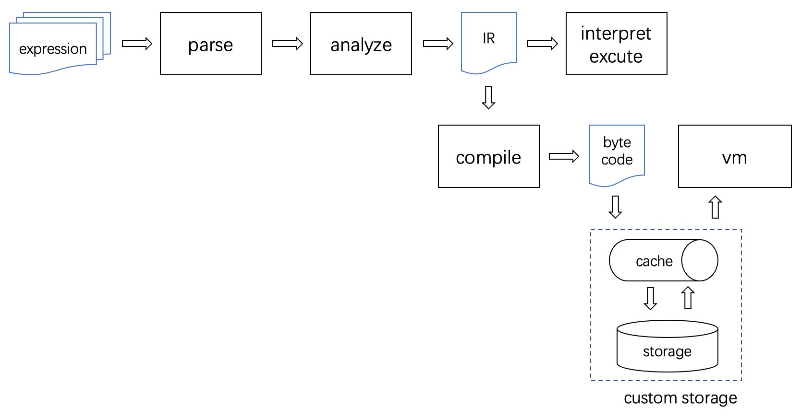
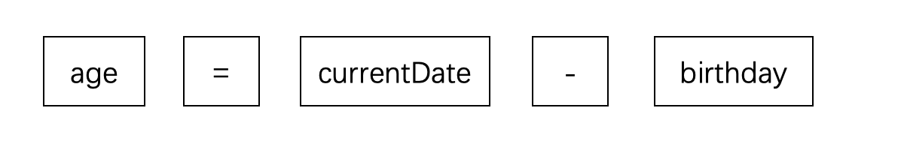

# 1. Overall Process


An expression in string form is processed by a parser through lexical and syntactic analysis to generate an Abstract Syntax Tree (AST). Then, during the analysis phase, the expression engine extracts all variable information from the expressions and sorts all formulas based on their dependencies, resulting in a sequentially executable Intermediate Representation (IR) structure called ExprInfo. Subsequently, there are two modes for executing the expressions: direct interpretation and execution, or compiling them into bytecode first to be run by a virtual machine.

# 2. Parsing
## Lexical Analysis
Lexical analysis is the first step in rspression's processing of expressions, with the goal of splitting string-format expressions into a list of words (tokens). We know that characters are the basic units composing strings, but for expression execution, arbitrarily extracting a fragment or substring of an expression for analysis is meaningless. For example:
```rust
age = currentDate - birthday
```
If we focus on "currentDate", we can determine this is a variable. If we focus on "=" or "-", we know these are operators, one for assignment and one for subtraction. However, if we focus on substrings like "rrentDa" or "ge = curr", these are meaningless for expression analysis. The purpose of lexical analysis is to process string-format expressions into a series of meaningful words, allowing subsequent processing stages of the compiler to focus only on the meaningful token list without needing to analyze the relationships between characters within the string. For example, the final meaningful processing result is:


Subsequent processing stages use only these five tokens as the basic processing unit.

The combinations of different characters that can form strings are infinite. However, as the basic units of expressions, token categories are fixed. All token categories are defined in the [token::TokenType](src/parser/token.rs) enumeration. The lexical analyzer scans the string from left to right and categorizes words into corresponding categories while creating tokens. At the code level, only the following cases need to be classified and handled:

- Single-character symbols: When a scanned character can only be a single-character symbol, such as ()[]{},.;-+/%etc., directly construct a token object
- Double-character symbols: When a scanned character could be either a single character or the start of a double-character symbol, look ahead one character to determine if it forms a corresponding double-character token, such as !=, ==, >=, <=, //, ** etc.
- Whitespace: Skip directly, including spaces, carriage returns, newlines, tabs, etc. Comments are also skipped directly.
- String literals: When a double quote is scanned, continue scanning until another double quote appears. The content between them constitutes a string literal.
- Numeric literals: When a digit is scanned, continue scanning until a non-digit character is encountered or the end is reached. The content in between constitutes a numeric literal.
- Identifiers: When a letter or underscore is encountered at the start, continue scanning. Subsequent characters that are letters, digits, or underscores continue to be scanned until a character that doesn't satisfy this or the end is reached. The collected content forms an identifier.
- Keywords: Keyword matching is handled as part of identifier matching. According to the keyword priority principle, whenever a completed identifier matches a keyword, a keyword token is formed.

For the complete implementation code, refer to [Scanner::Scanner](src/parser/scanner.rs)

## Syntax Analysis
To obtain the syntax tree, the expression engine uses the Pratt parser algorithm during the syntax analysis phase.

Traditional recursive descent parsers require writing separate parsing functions for each priority level when parsing expressions. They then call parsing functions layer by layer from low to high priority. For example, assign() parses assignments, term() parses addition and subtraction, factor() parses multiplication and division. Then assign() would call term(), and term() would call factor(). This easily leads to bloated code, and adding new syntax requires restructuring existing logic, increasing program maintenance difficulty.

# 3. Analysis

# 4. Interpretation Execution

# 5. Compilation

# 6. Virtual Machine Execution
